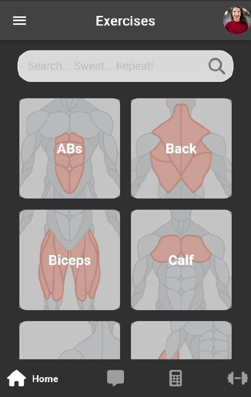
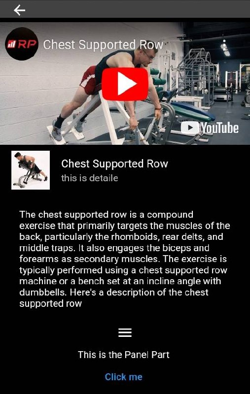
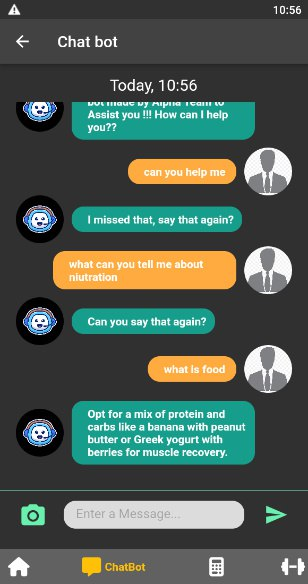
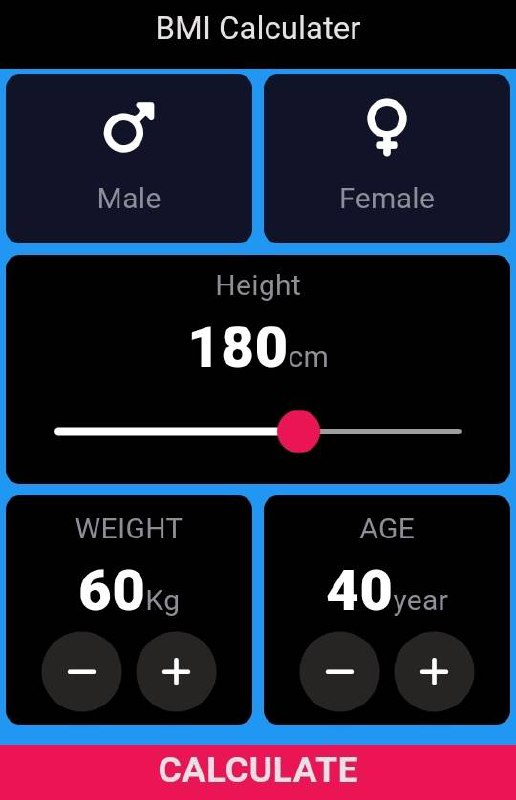

# Fitness V2


Fitness V2 is a comprehensive fitness application built using Flutter. It aims to provide users with a seamless experience for tracking workouts, monitoring progress, and accessing fitness-related content.

## Features

- **Workout Tracking**: Log and track your workouts with ease.
- **Progress Monitoring**: Visualize your progress with charts and statistics.
- **Video Integration**: Watch workout videos directly within the app using YouTube Player.
- **Localization**: Supports multiple languages using `easy_localization`.
- **Notifications**: Get reminders and notifications for your workouts.
- **Firebase Authentication**: Secure user authentication with Firebase.
- **Customizable UI**: Aesthetic and user-friendly interface with smooth animations.

## Screenshots

### Home Screen


### Workout Tracking


### Live chat Bot


### BMI calculator

## Installation

### Prerequisites

- Flutter SDK: `>=2.19.6 <3.0.0`
- Dart SDK: `>=2.19.6 <3.0.0`

### Steps

1. **Clone the repository**
    ```sh
    git clone https://github.com/Haileliul/fitness-v2.git
    cd fitness-v2
    ```

2. **Install dependencies**
    ```sh
    flutter pub get
    ```

3. **Generate localization files**
    ```sh
    flutter pub run easy_localization:generate -S lib/translations -O lib/translations
    flutter pub run easy_localization:generate -S "lib/translations" -o "lib/translations/local_keys.g.dart" -f keys
    ```

4. **Run the app**
    ```sh
    flutter run
    ```

## Usage

Once the app is installed and running, you can:

- **Log Workouts**: Add details of your workouts including type, duration, and intensity.
- **View Progress**: Check your progress over time with detailed charts.
- **Watch Videos**: Access workout videos directly within the app.
- **Set Reminders**: Get notified about your workout schedules.

## Configuration

### Firebase

To enable Firebase authentication, you need to set up a Firebase project and add the `google-services.json` (for Android) and `GoogleService-Info.plist` (for iOS) files to the respective directories.

### Localization

To add support for more languages, update the translation files in the `lib/translations` directory and regenerate the localization keys.

## Contributing

We welcome contributions from the community! To contribute:

1. Fork the repository.
2. Create a new branch (`git checkout -b feature-branch`).
3. Make your changes.
4. Commit your changes (`git commit -m 'Add some feature'`).
5. Push to the branch (`git push origin feature-branch`).
6. Open a pull request.

## License

This project is licensed under the MIT License. See the [LICENSE](LICENSE) file for details.

## Contact

For any questions or feedback, please open an issue on GitHub.

---

Thank you for using Fitness V2! Stay fit and healthy!

